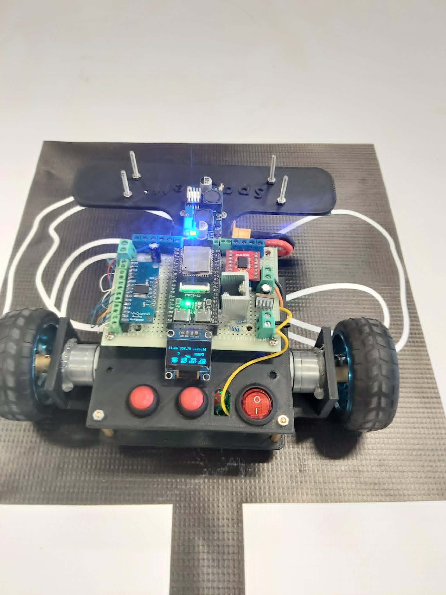
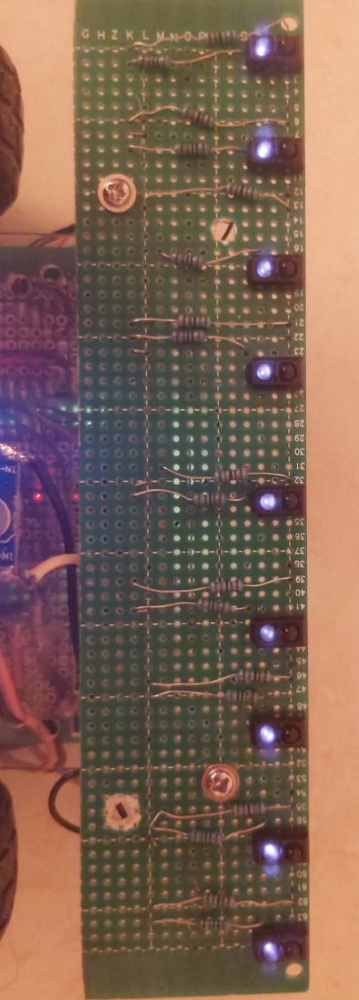

# 🏁 Spaghetti — Line Following Robot (ESP32-S3)

Autonomous line-following robot developed for robotics competitions using ESP32-S3, RTOS, and a custom embedded control system.

---

## 📸 Robot



---

## 🚀 Overview

This is my third line-following robot and the final version of a 3-stage evolution built during my first year in robotics competitions.

The goal was to improve:
- stability at high speed  
- sensor accuracy  
- control system reliability  
- real-time debugging  

---

## ⚙️ System

- ESP32-S3 main controller  
- RTOS-based firmware  
- MPU6050 gyro sensor  
- Magnetic wheel encoders  
- 9× TCRT5000 IR sensor array  
- CD74HC4067 analog multiplexer  
- SSD1306 OLED display  
- WebSocket debugging system  

---

## 🧠 Control

- PID line following  
- encoder feedback control  
- IMU heading correction  
- real-time tuning during runs  

---

## 📷 Sensor Array



Custom 9-sensor IR array using TCRT5000 with analog multiplexing.

---

## 🔌 Pinout

### Motors
```c
#define PIN_PWMR 40
#define PIN_RF 42
#define PIN_RB 2
#define PIN_PWML 39
#define PIN_LB 1
#define PIN_LF 41
Encoders
#define PIN_ENCODER_RIGHT_A 21
#define PIN_ENCODER_RIGHT_B 47

#define PIN_ENCODER_LEFT_A 46
#define PIN_ENCODER_LEFT_B 45
Multiplexer
#define PIN_MUX_SIG 14
#define PIN_MUX_S0 19
#define PIN_MUX_S1 20
#define PIN_MUX_S2 3
#define PIN_MUX_S3 48
I2C
#define PIN_SDA_0 4
#define PIN_SCL_0 5

#define PIN_SDA_1 17
#define PIN_SCL_1 16
